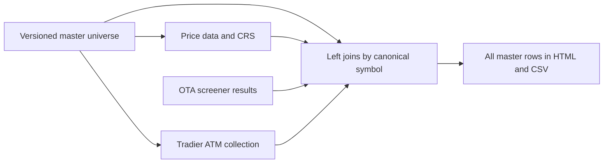

# AAA Options Scanner

Cross-sectional momentum with a combined OTA research dashboard, session history,
configurable shortlist filters and a user-run daily workflow. Synthetic examples
need no packages or credentials. Authenticated requests remain user-run.

## New here? Start with guided setup

Read [First local setup](docs/SETUP.md) for Windows PowerShell, macOS Terminal or
Ubuntu/WSL. No accounts or API keys are needed for the first demo.

If using a coding assistant, say:

> Follow docs/SETUP_AGENT.md. Help me set up this repo. Ask my OS and whether I
> prefer beginner, guided or concise instructions.

The [setup agent guide](docs/SETUP_AGENT.md) defines an interactive assistant role;
it is not a separate installed chatbot or executable. It adapts explanations and
checks progress before dependent steps. The manual guide works without an assistant.

## Direction and development scope

This is currently **one user's personal local workspace**. Development and tests
stay local. The planned progression is shared application services, durable local
jobs, a local web interface, then a separately approved sharing/hosting phase.
A saved-results localhost preview is now available through `run.py web` (C3a).
Durable provider jobs and hosting remain deferred; scheduling stays disabled in
the preview. See [local web startup and acceptance](docs/LOCAL_WEB.md).

See [Future enhancements and architecture plan](docs/FUTURE_ENHANCEMENTS.md) for
module boundaries, migration steps, acceptance gates and deferred decisions.
Every implementation request is reviewed against that direction, proportionally,
while preserving the current CLI and avoiding speculative infrastructure.

## Try the localhost preview

Follow [LOCAL_WEB.md](docs/LOCAL_WEB.md) to install pinned optional dependencies,
start `web --demo`, and then select your own indexed saved sources. It includes
CRS tail filters, pagination, source/quote coverage and full/filtered CSV downloads.
Core checks: 205 passed; optional guarded web checks: 11 passed; synthetic HTTP
start/report/CSV/stop passed on Ubuntu. Browser/Excel and native OS acceptance
remain pending. No provider fetch or scheduler is started by the web app.

## First combined output

From the project root, generate the draft with invented data:

```bash
python3 -I -S run.py dashboard-demo
```

For your already saved public prices and OTA results (no request or token needed):

```bash
python3 -I -S run.py dashboard
```

Windows equivalents: `py -3.11 -I -S run.py dashboard-demo` and
`py -3.11 -I -S run.py dashboard`. Open the printed `dashboard.html` path.
The table joins CRS and OTA by normalized symbol, with search, sorting, stock/ETF
and long/short filters. `master.csv` (also exported as `combined.csv`) includes
every master symbol, CRS score/rank/percentile, 21/63/126-session returns, all
captured OTA fields under `ota_raw.*`, and interpreted metrics. CSV files use
UTF-8 with a BOM for Excel. Returns and percentile are fractions: format those
columns as percentages in Excel. Candidate and departed-symbol exports remain
separate. OTA symbols outside the master are counted, not added to its rankings;
use `ota-report` for the complete OTA inventory.
OTA does not alter CRS scores. Missing matches mean absent from the filtered
screener, not zero volume. Provider definitions remain unverified.

In HTML, use **CRS selection** → **Long research: top X%**, **Short research:
bottom X%**, or **Both tails**, and set **X (%)** (default 10). **CRS order** sorts
strongest or weakest first; column headers also sort. Percentiles use the full
stock/ETF peer groups, not the visible subset. Search/group/fixed-label/review
filters combine with the tail selection; leave fixed labels and review at All
for a pure percentile screen. UI filtering does not change CSVs or candidate rules.

**OTA field diagnostics** describes numeric conversion or missing/unusable input;
it is not a score. **Tradier Status** explains quote availability. Tradier files
are attached explicitly: add `--tradier PATH_TO_SAVED_BATCH_JSON` (or a saved
`atm-spreads.json`) to the dashboard command. Without it, status is `not_supplied`
and quotes are blank. The report displays the attached-row count and makes no
network requests. Missing metrics remain unavailable even for an attached row.

`dashboard` selects the newest saved files by modification time. Use
`--snapshot PATH --ota PATH` to select exact inputs. Synthetic/public profiles
cannot mix. Output includes copies of inputs and settings for reproduction.
Each profile stores one history record per price session; repeated runs replace
that session, never add streak days. Rank change is against the prior recorded
session, with gaps and newly ranked symbols labeled. First real run has no prior
history. Universe changes can also change ranks.

Edit [config/candidates.json](config/candidates.json), or pass `--filters PATH`.
Defaults retain tail rows with open interest >=10,000, options volume >=90,000
and vendor liquidity >=85. Optional earnings/mean-IV thresholds default to null
(disabled). Missing required values or stale inputs cannot match. Defaults allow
OTA retrieval age <=36 hours and price age <=4 calendar days. The price-age limit
is not proof of the latest exchange session; use a refresh for a current report.
Green rows mean numeric settings match, with metric definitions still unverified.

## One-command daily run

After public dependency setup below, with an active OTA browser session:

```bash
.venv/bin/python -I run.py daily --profile public
```

```powershell
.\.venv\Scripts\python.exe -I run.py daily --profile public
```

This refreshes prices, prompts for the current OTA token, fetches pages (100 rows
by default), then writes the combined dashboard. Each stage has standard progress
and its own log/review report. A failed stage stops the workflow; it never silently
uses yesterday's output. `--page-size` and `--max-pages` are available. Cached
`dashboard` is the no-download reuse path; daily refresh deliberately downloads
full adjusted histories to avoid incorrect incremental split/dividend merging.
This command runs immediately. For a personal daily time, see
[Scheduling](docs/SCHEDULING.md); session renewal remains manual.

## Optional local credential storage

Use your OS credential store, outside Git. Install the reviewed optional direct
pin using wheels; transitive dependencies remain unlocked:

```bash
.venv/bin/python -m pip install --only-binary=:all: -r requirements-keyring.txt
.venv/bin/python -I run.py ota-token set
.venv/bin/python -I run.py daily --profile public --use-stored-token
```

```powershell
.\.venv\Scripts\python.exe -m pip install --only-binary=:all: -r requirements-keyring.txt
.\.venv\Scripts\python.exe -I run.py ota-token set
.\.venv\Scripts\python.exe -I run.py daily --profile public --use-stored-token
```

`ota-token set` takes hidden input; `ota-token delete` removes the local copy.
Storage does not extend OTA session lifetime. After expiry, sign in locally and
set the new token. Default fetch still prompts and never consults stored tokens.
The explicit native backends are Windows Credential Locker, macOS Keychain and
Linux Secret Service; there is no plaintext fallback. Linux/WSL requires an
available, unlocked Secret Service and session D-Bus; otherwise setup fails with
`TOKEN_STORE_UNAVAILABLE`. See [keyring documentation](https://keyring.readthedocs.io/en/stable/).
Native store execution remains user-validation pending.

If WSL reports `TOKEN_STORE_UNAVAILABLE`, storage failed locally; it is not a
Tradier authentication response. Missing keyring dependencies, unavailable Secret
Service/D-Bus or a locked store can cause it. The exact cause is not established
by that safe error. For the standalone probe after draft approval, bypass storage:

```bash
.venv/bin/python -I run.py tradier-probe --profile sandbox --symbol SPY --prompt-token
```

Use `production` with a production key. This prompts invisibly for this run only,
never reads/writes the OS store and requires no keyring package. It still makes
an authenticated market-data request when you run it. PowerShell uses
`.\.venv\Scripts\python.exe` with the same arguments.

Paste only the token; surrounding paste whitespace is trimmed. Empty input or
internal whitespace is rejected locally as `TRADIER_TOKEN_INVALID`, before any
provider request. No account number is needed for market quotes/options chains:
see [Tradier's chain endpoint](https://docs.tradier.com/reference/brokerage-api-markets-get-options-chains).


For your Tradier key, choose the profile matching the key and run locally:

```bash
.venv/bin/python -I run.py tradier-token set --profile production
```

```powershell
.\.venv\Scripts\python.exe -I run.py tradier-token set --profile production
```

Use `sandbox` instead for a sandbox key. Paste only into the hidden terminal prompt,
never chat, command arguments or a tracked file. Profiles have separate OS entries.
`tradier-token delete --profile production` removes the local copy; revoke at
Tradier separately if needed. After approving the draft, the standalone user-run
probe is `.venv/bin/python -I run.py tradier-probe --profile production --symbol SPY`; on Windows use `.\.venv\Scripts\python.exe`.
It is not part of `daily` or the dashboard. If New York timezone data is missing,
the probe stops with `DEPENDENCY_UNAVAILABLE`; supply `--as-of YYYY-MM-DD` using
the current New York date as an explicit portable alternative. See [source access](docs/SOURCES.md)
and [monthly ATM plan](docs/CHAIN_PLAN.md) before live testing.

## Run the demo now

From this project's root on Ubuntu/WSL or macOS:

```bash
python3 -I -S run.py demo
```

On native Windows PowerShell (Python 3.11):

```powershell
py -3.11 -I -S run.py demo
```

Open the printed `report.html` path in a browser. Filter by stocks, ETFs, sector
ETFs or long/short/neutral; search symbols/companies and click headers to sort.
Demo prices and tickers are invented. The weekday-only demo calendar is synthetic.

Each run saves `universe.csv`, `rankings.csv`, `excluded.csv`, `results.json` and
`snapshot.json` alongside the HTML report. Runs get unique directories, preserving
earlier snapshots. Public and synthetic artifacts are separated and ignored by Git.

## Standard progress and run logs

All commands share stdout progress and structured logs. In an interactive terminal,
the progress bar **refreshes in place** using carriage returns; stage completions,
warnings, errors and the final summary remain on separate lines. The current step
is displayed before work begins. Tradier batches show expiration, underlying-quote
or chain work while retaining the overall completed-symbol counter. Bars show
per-stage completion, not a runtime estimate or proof that all data is usable.
Narrow terminals use a compact step/count/percentage display to avoid wrapping.

Stdout timestamps default to the **runtime machine's local timezone**, including
its UTC offset. Configure the operating system/WSL timezone to your preference;
the scanner does not infer your location or hardcode a zone. Each event computes
its local offset, so daylight-saving changes are reflected. Structured logs retain
both local and UTC timestamps; elapsed durations use a monotonic clock.

```text
2026-09-19T15:04:05-07:00 INFO [######--------------]  30% 3/10 Fetching monthly option chain
```

Fetches display conservative, provisional completion estimates based on pacing,
request workload and observed latency. During pacing waits the current step stays
visible. Prompts clear the transient display before accepting input.
Redirected output and IDE output panes that do not expose a terminal use plain
newline-delimited messages, with no carriage returns or escape sequences. No new
package is required. Existing fetch commands stay the same.

Fetch pacing, conservative ETAs and local feedback are described in
[Provider throttling](docs/THROTTLING.md). Feedback is ignored by Git.

Every run creates two exclusive UTF-8 files, whose paths are printed at startup
and again in the final summary:

- `artifacts/logs/<run_id>.jsonl`: every structured event.
- `artifacts/logs/<run_id>.errors.log`: JSON Lines containing warnings and errors
  only; empty when none occurred. Tradier symbol-specific failures are included.

Log schema version **2** adds `timestamp` (local ISO 8601), `timezone` (local zone
label) and `step` (current substep), retaining `timestamp_utc` and existing fields:
sequence, severity, run ID, code revision, command/profile, stage/event, fixed
message, completed/total counts, percentage, elapsed seconds, counts and safe error
code. Existing version-1 files remain unchanged. Both files flush each event.

The final stdout summary includes completion/partial/failure/cancellation status,
elapsed time and available operation counts: master members, attempted/returned/
failed symbols, HTTP requests, OTA pages/rows or probe chains/rows, as applicable.
Counts accumulated in progress events are retained in the final run log event.
Commands also print their output and sanitized `Agent review:` paths. For debugging,
start with the error log and sanitized report. Ctrl+C records cancellation and
returns exit code 130; a failed stage keeps its actual progress rather than 100%.

Previous logs are preserved; no retention deletion occurs automatically. Logs
exclude symbols, raw responses, arbitrary exception text, URLs, headers and
credentials. Provider stdout/stderr remain suppressed where configured. No general
HTTP tracing is enabled. If log creation itself fails, files may be unavailable;
check the safe terminal error and local permissions/disk space.

These are project requirements in [AGENTS.md](AGENTS.md#logging-and-progress-requirements),
including for future fetch adapters. Commands must use `RunProgress` and fixed
stages/error codes with allowlisted numeric counts. Agents still inspect only intended `artifacts/agent-review/`
reports after user-run fetches; ordinary logs remain user-facing files.

## Download public data (user-run)

This command builds the current S&P 500 membership from Wikipedia, combines it
with [11 sector ETFs and 50 starter ETFs](config/etfs.csv), and downloads daily
adjusted prices with yfinance. SPY is included among the 50. The watchlist is
**not a verified top 50 by options volume**; optionability, current fund metadata,
and liquidity still need provider validation. There are no leveraged/inverse
funds intentionally selected. The old incoming supplemental stock list is not
included in this first universe.

Membership is acquired separately from price history; yfinance does not provide
the S&P membership table here. Wikipedia is a convenient secondary source, not
the index administrator. Schema/count changes fail closed. Each downloaded
snapshot records source attribution and membership observation time; this current
universe must not be used as a historical backtest membership list.

Supported target: Python 3.11–3.14. Only the standard-library path on Ubuntu with
Python 3.14.4 has been executed so far. Direct optional dependencies are pinned
in [requirements-public.txt](requirements-public.txt); transitive versions are
not locked yet. Use a separate virtual environment for each operating system.
Installation below requests wheels only, so source-build hooks are not executed.
If a compatible wheel is missing, stop and review the package/platform instead of
removing that restriction without review.

Ubuntu/WSL (macOS uses the same Python commands):

```bash
python3 -m venv .venv
.venv/bin/python -m pip install --only-binary=:all: -r requirements-public.txt
.venv/bin/python -I run.py refresh --profile public
```

Native Windows PowerShell:

```powershell
py -3.11 -m venv .venv
.\.venv\Scripts\python.exe -m pip install --only-binary=:all: -r requirements-public.txt
.\.venv\Scripts\python.exe -I run.py refresh --profile public
```

No Yahoo account token is requested or loaded by this application. yfinance is
an unofficial public-data interface and manages anonymous session cookies. The
user runs this path; agents do not inspect those cookies or run provider calls.
Downloads can fail or return partial data. Failed downloads never become synthetic
prices. Missing symbols remain in the master list and appear in exclusions.

The downloaded snapshot is the local cache: re-running a ranking uses it without
network access. A refresh deliberately obtains a new complete snapshot, because
adjusted historical prices can change after corporate actions. Incremental cache
merging remains deferred. Personal local scheduling is available through
[the shared schedule service](docs/SCHEDULING.md).

## Replay a saved snapshot offline

Use the exact `snapshot.json` path printed by a previous run in place of the
example path below. Replays show the original as-of date, not fresh market data.

```bash
python3 -I -S run.py cached --snapshot artifacts/runs/public/RUN_ID/snapshot.json
```

```powershell
py -3.11 -I -S run.py cached --snapshot artifacts/runs/public/RUN_ID/snapshot.json
```

## Score definition

1. Use a common completed XNYS session and adjusted closes from exactly 21, 63,
   and 126 sessions earlier: `return = latest / earlier - 1` (fractional units).
2. Within stocks and ETFs **separately**, clip each horizon's returns to its mean
   plus/minus three population standard deviations, then calculate z-scores.
3. Combine horizon z-scores with weights **0.50 / 0.25 / 0.25** and standardize
   that composite again. Higher means stronger cross-sectional momentum.
4. Equal scores share a midrank percentile. Top/bottom 10% are labeled long/short
   candidates. All-equal data is neutral. At least 20 valid members are required
   per peer group. Display ranks break ties alphabetically; scores/percentiles do not.

The sector ETF filter shows their ranks among **all ETFs**, not a new 11-member
ranking. Bond/commodity/equity ETFs share the ETF distribution in this first
version; asset-class grouping is a possible later refinement.

Prices are adjusted with yfinance `auto_adjust=True`, explicitly; no automatic
repair, volatility adjustment, or missing-price imputation is enabled. Live dates
come from `exchange_calendars` XNYS closes, including early closes and DST, with a
one-hour publication buffer. The last 127 expected session prices must all be
finite and positive. Missing endpoints/history are excluded, not shifted to an
older date. Review exclusion counts: scores are relative to the valid subset,
and extensive missing data changes that comparison universe.

Compared with the [reference](reference/README.md), exact trading-session returns
replace Finviz's calendar-period performance fields; ties are equalized, missing
history is excluded, and stock/ETF peer groups are separate. No persistence or
Conviction score is included. This implements a ranking calculation, not evidence
of profitable execution. Fees, slippage, orders and performance backtests are out
of scope; scores are not calibrated probabilities or executable quotes.

## Verification and safe diagnostics

Run from the project root on Ubuntu/WSL/macOS:

```bash
python3 -I -S tools/test_intake_scan.py
python3 -I -S tools/test_offline.py
```

Native Windows PowerShell:

```powershell
py -3.11 -I -S tools/test_intake_scan.py
py -3.11 -I -S tools/test_offline.py
```

The application test runner installs network, subprocess, environment-read and
file-read guards **before collection**. It only collects `tests/`, never INBOX
or the historical reference. All provider tests use synthetic responses. The
guards protect reviewed Python code; they are not a general hostile-code sandbox.
Do not run bare pytest: the mandatory isolation entry point is `tools/test_offline.py`.

After a user-run refresh, agents may read only the printed JSON report under
`artifacts/agent-review/`. It contains a run ID, implementation SHA-256 revision,
profile, check status, counts and allowlisted error code. It contains no symbols,
account data, raw responses, headers, cookies, or exception messages. The market
snapshot and HTML/CSV reports are for the user, not agent diagnostic intake.

`DEPENDENCY_UNAVAILABLE` means the optional packages are absent from the selected
interpreter. `CONSTITUENTS_SCHEMA_CHANGED` or `CONSTITUENTS_COUNT_INVALID` needs
parser/source review. `NO_VALID_PEER_GROUP` means too few complete price series.
`SCAN_FAILED` is a sanitized unclassified provider/input failure. Do not enable
verbose HTTP logs or share raw captures to diagnose it.
`LOG_UNAVAILABLE` indicates that a run log could not be created/written;
check local disk space and permissions. A scan does not start if log creation fails.

Offline checks passed; live checks pending. Native Windows/macOS, browser
interaction, optional dependency installation, and real provider responses remain
unverified for this new increment. Hosted CI is deferred; verification runs locally. Git hooks remain unconfigured.

## Sources and next increment

- [yfinance documentation](https://ranaroussi.github.io/yfinance/reference/api/yfinance.download.html)
- [exchange_calendars](https://pypi.org/project/exchange_calendars/)
- [S&P 500 constituent table](https://en.wikipedia.org/wiki/List_of_S%26P_500_companies)
- [Select Sector SPDR issuer list](https://www.ssga.com/uk/en_gb/intermediary/capabilities/equities/sector-investing/select-sector-etfs)
- [Intake ledger](docs/INTAKE.md) and [project status](docs/STATUS.md)

The combined dashboard, history and candidate filters are now implemented.
Next: review the draft, validate the user-run daily workflow and standalone
Tradier probe. A verified options-volume ETF selection dataset and exact OTA
metric definitions remain pending. See [source access](docs/SOURCES.md).

## Offline options enrichment

Run `python3 -I -S run.py demo --with-options` to preview separate IV rank,
IV percentile, options volume and open interest alongside unchanged momentum ranks.
Missing data remains unknown. See [input format and OTA access checks](docs/OPTIONS.md).
This enrichment report is offline; the separate user-run OTA connection check is described below.

## Paste OTA screener criteria into configuration

Use this whenever you change filters in OTA's screener. The offline `ota-config`
tool validates a pasted **complete request-body criteria array** and produces
`config/ota-screener.json`. It changes configuration, not Python source. No account,
token, clipboard package or third-party dependency is required.

From the project directory, preview a paste in Bash/Linux/WSL:

```bash
python3 -I -S run.py ota-config
```

Paste the complete array and press Enter; no EOF or Ctrl-D is required. To validate
and save in one run, use `python3 -I -S run.py ota-config --apply` instead.

Native Windows PowerShell:

```powershell
py -3 -I -S run.py ota-config --apply
```

Paste the array and press Enter. Multiline pastes submit after the closing `]`
and Enter; brackets inside quoted values do not end input. Press Ctrl-C to cancel
an unfinished paste. For help with a pasteable example, run
`python3 -I -S run.py ota-config --help` (PowerShell: `py -3 -I -S run.py ota-config --help`).
Alternatively, save only the criteria in a UTF-8 text file under
ignored `artifacts/`, then preview and apply the same file:

```bash
python3 -I -S run.py ota-config --input artifacts/ota-criteria.txt
python3 -I -S run.py ota-config --input artifacts/ota-criteria.txt --apply
```

In PowerShell use `py -3 -I -S` in place of `python3 -I -S`.

Example accepted input (complete JSON also works):

```text
[
  {field: "optionable", valueFilter: "BOOLEAN", valueChoices: "Yes", criteria: "true"},
  {field: "last", valueFilter: "RANGE_INSIDE", valueMin: 15, valueMax: 200, criteria: "true"}
]
```

The input must contain complete objects with double-quoted strings. DevTools
abbreviations (`…` or `...`), numbered display rows (`0: {...}`), Markdown bullets,
comments, trailing commas and executable expressions are rejected. Copy only the
complete criteria array, never headers, tokens, cookies, cURL or HAR exports.

Supported filter types: `SELECT`, `SELECT_CODED`, `BOOLEAN`, `RANGE_INSIDE`,
`RANGE_OUTSIDE`, `COMPARE`. Selection values must be strings; Boolean choices are
`Yes`/`No`. Optional `criteria` flags retain their Boolean or `"true"`/`"false"`
form. Range bounds must be finite numbers in ascending order. Unknown keys,
unsupported filter types, repeated fields/keys and incomplete entries fail closed.
Limits: 200,000 input characters and 100 criteria. New provider shapes require an
explicit parser update rather than silently losing fields.

OTA range objects may also include `valueChoices` equal to `RANGE_INSIDE` or
`RANGE_OUTSIDE`; the tool preserves this optional field and checks that it matches
`valueFilter`. Paste the original payload with plain underscores (`sma_50`,
`RANGE_INSIDE`). Chat/Markdown escapes such as `sma\_50` are invalid JSON and are
rejected. The saved configuration wraps the original array in `criteria`; that
array is the future POST body, not the entire configuration object. Both `"true"`
and `"false"` criteria flags are preserved; the tool does not activate every filter.

Without `--apply`, the tool prints a preview and leaves configuration untouched.
With `--apply`, it replaces the entire criteria list atomically; it does not merge
with old filters. Invalid input leaves the existing file intact. The generated
non-secret configuration can be reviewed with `git diff -- config/ota-screener.json`
once tracked; a newly created file initially appears as untracked in `git status`.
Progress and fixed-metadata JSONL logs use the standard `artifacts/logs/` location;
pasted text and filter values are not written to those logs. Validated configuration
is intentionally shown in the local terminal preview.

This prepares the request configuration for OTA integration. **It does not yet
connect to OTA or alter momentum calculations.** The row parser also exists, but
the paginated transport is available below. Live paging and timestamps remain unverified.
README usage notes and project status are updated with each implemented feature.

## OTA: paginated screener fetch (user-run)

The owner has confirmed permission for personal scripted access. The `ota-fetch`
command sends paginated POST requests using `config/ota-screener.json` and prompts
for a token without echo. It uses standard-library HTTPS with certificate checking,
a 30-second socket timeout, no cookies, redirects, retries or proxy-environment
discovery. No dependency installation is needed. It fetches screener matches;
joining them to the momentum report remains a separate next feature.

At the owner's request, OTA requests send a fixed Chrome-style `User-Agent`
(`Chrome/153.0.0.0` on Windows) for compatibility. This does not reflect the actual
OS/browser, provide authentication, or guarantee acceptance by OTA. No browser
cookies are copied. Fixed Origin, Referer, language, client hints, fetch metadata
and priority headers match the requested browser profile. HTTP/2 pseudo-headers
are represented by the HTTPS host, POST method and request path, not copied as
literal headers into this HTTP/1.1 client. Content-Length is calculated from the
encoded payload. Accept-Encoding stays `identity` because compressed response
decoding is not implemented. These headers do not reproduce a browser's TLS stack.

1. Sign in to your own OTA account in Chrome. Open Developer Tools → Network →
   Fetch/XHR, then load your screener normally.
2. Select the successful POST to `/api/secure/screeners/criteria/results`.
   Under Request Headers, copy only the **value** of `x-auth-token` locally.
   Do not copy the header name, quotes, the whole request, cookies or a HAR export.
3. In a normal local terminal at the project root, run:

   ```bash
   python3 -I -S run.py ota-fetch --profile ota
   ```

   Native Windows PowerShell:

   ```powershell
   py -3 -I -S run.py ota-fetch --profile ota
   ```

4. Paste at the hidden prompt and press Enter. No characters should display.
   The token is used in memory and is not saved; clear it from your clipboard
   afterward. If hidden input is unavailable, the command stops. Do not redirect
   a token into stdin or pass it on the command line.
5. Give the agent only the printed `artifacts/agent-review/<run-id>.json` path.
   That report contains fixed status/error codes and counts, with no token,
   headers, response body, identifiers or symbols. The raw `results.json`
   under `artifacts/ota/` is for your local review, not agent intake.

`OTA_AUTH_REJECTED` means 401/403: the token might have expired, or the request
may require different access. Sign in normally and obtain your current token for
a deliberate retry; do not assume expiry is the cause. `OTA_RATE_LIMITED` stops
without retry. Both a bare row array and the reference adapter's `results.data`
envelope are supported. `OTA_ENVELOPE_UNSUPPORTED` means another outer structure;
share only its field names/nesting so the parser can be adjusted. Never share raw responses.
An empty first page means zero matches for this request, not the entire market.

`OTA_SCHEMA_INVALID` now concerns invalid JSON or row structure, not an unusual
metric value. Where available, a fixed diagnostic identifies the structural issue.
Authentication, response-size, symbol identity and pagination checks remain strict.
Unexpected metric types/values are retained for profiling and later interpretation.

The owner verified on 2026-09-19 that the token expires with the OTA session.
Treat it as session-bound, not a long-lived API key. Before fetching, open OTA,
sign in and copy the current token into the hidden prompt. After the session
expires, establish a new session and obtain a fresh token. On 401/403 the script
stops; it never refreshes credentials or automates login. Other access failures
can also produce 401/403, so renewal is not a guaranteed fix.

Default fetch prompts without saving. Optional OS storage, described above,
reduces pasting during an active session but cannot extend its lifetime or enable
unattended daily runs across expired sessions. Exact idle
timeouts and server-side revocation mechanics remain unverified. Python does not
guarantee secure erasure of in-memory strings.

Results retain vendor metric names and a retrieval time; the market observation
time is unknown. Pages use your selected filters. `daily` and `dashboard` join
saved OTA values to momentum rankings. [Local scheduling](docs/SCHEDULING.md)
can trigger these workflows, but cannot renew an expired OTA session.
The earlier single-page
user-run check passed with 77 rows and no errors
(review report `126d95ced37a4481b0e217b61b7d89e2`). Full coverage and metric
interpretation remain unverified; the current offline suite passed 125 tests.

### Pagination and limits

The default page size is **100**, with at most **100 requests**, including the final
short-page response. Page numbers start at 1 and increase; the payload and symbol-ascending
sort remain unchanged. Fetching stops when a page has fewer rows than requested,
matching the reference adapter. For 77 matches with the default size, only one
request is made. Full pages continue to the next page. A 5,642-row result takes
57 pages: 56 full pages and one page of 42 rows.

`ota-config --apply` updates screening criteria, not the fetch page budget.
After `ota-config --apply`, note the absolute saved path and Criteria SHA256.
The next fetch prints the same path and fingerprint for the criteria it actually
sends. Different fingerprints mean different criteria; different paths indicate
different checkouts. Changing the website alone does not update this local file.
Sanitized fetch review reports include `request_config` with that fingerprint,
criteria/enabled counts and page settings, excluding criteria values and paths.

The default budget is shared by `ota-fetch` and `daily`. It is a safety ceiling,
not a requested result count; an explicit `--max-pages 50` still stops at 50.

Override limits when needed:

```bash
python3 -I -S run.py ota-fetch --profile ota --page-size 100 --max-pages 100
```

PowerShell uses `py -3 -I -S` instead of `python3 -I -S`. Allowed page sizes are
1–600; page limits are 1–100. The per-response byte limit remains 2 MB; reduce the
page size if `OTA_RESPONSE_TOO_LARGE` occurs.

Repeated symbols across pages fail with `OTA_DUPLICATE_PAGE_SYMBOL`; reaching the
limit before a short page fails with `OTA_PAGE_LIMIT`. Authentication, rate-limit
and schema failures also stop immediately. No combined data file is written unless
all requested pages finish through short-page termination. Existing run outputs
remain separate and untouched. Progress is measured against the page limit until
termination establishes the actual page count, not an estimate of market coverage.

The sanitized report uses check `ota_paginated_fetch` and counts rows published,
pages requested, pages received and symbols received before failure. The user data
file records `coverage: short_page_observed`. This is not guaranteed completeness:
the provider may cap page size or ignore page numbers; realtime membership may change
between pages. Pagination has passed offline tests; live validation of page size
and server paging behavior remains pending your next user-run report.

## Cross-platform checks

GitHub Actions is **inactive in this checkout**. Development and testing are local:

```bash
python3 -I -S tools/test_offline.py
python3 -I -S tools/test_intake_scan.py
```

On native Windows, use your local `python` executable with the same arguments.
The [future CI example](docs/future-ci/offline.yml.example) is stored outside
`.github/workflows/` and cannot trigger Actions from that location. Do not activate
hosted CI until explicitly requested. If an older workflow is still on GitHub,
disable it in **Actions → Offline verification → … → Disable workflow**, or run
`gh workflow disable offline.yml` yourself from this repository. This local change
does not disable the remote copy until you push it; agents do not push.

### Tradier schema diagnostics

If a probe reports `TRADIER_SCHEMA_INVALID`, rerun the same user-run command
with the current code and share only its `artifacts/agent-review` report. The
report now includes the last endpoint category, HTTP status when received and
a fixed allowlist of schema paths with type names (no response values, arbitrary
provider keys, URLs, symbols or headers). Zero parsed chains does not identify
which request failed. A 200 HTTP response alone does not prove a valid schema.

The expiration request uses `expirationType=false` for the simple date list;
monthly classification still comes from option-chain `expiration_type` metadata.
The parser also accepts the structured `expirations.expiration` envelope and
rejects ambiguous envelopes. The earlier failure's exact cause remains unverified
until the updated diagnostic is returned. Curl can isolate transport issues,
but this probe's sanitized report is sufficient for schema debugging; do not
paste raw authenticated captures or headers into chat.

### Raw capture, profiles and processing

`ota-fetch` preserves bounded HTTP-200 response bodies before JSON/row validation.
It never stores the outgoing token or request/response headers. Each run has:

| File | Meaning |
| --- | --- |
| `pages/001.body.json` | Original response bytes, including whitespace/numeric spelling; may contain malformed JSON if acquisition fails. |
| `pages/001.json` | Decoded response plus page number and retrieval time, when JSON decoding succeeds. |
| `capture.json` | Collected structurally accepted rows, original values, criteria and run metadata; starts incomplete. |
| `results.json` | Raw rows published only after a short page completes acquisition. Completeness beyond this stopping rule remains unverified. |
| `field-profile.json` | Per-field observed types, missing/null/blank counts, numeric/text string counts, negative counts, finite numeric min/max. |
| `normalized.json` | Separate versioned typed/usable metrics with `parsed_values` and `field_status`; never overwrites raw data. |

Profile fields come from the immediate `values` object. Nested objects and arrays
are counted as those types and preserved intact in raw data, not recursively
flattened. Present type counts partition present rows; blank/numeric/other string
counts subdivide strings, while negative counts are subsets. Missing counts are
relative to all captured valid rows. Numeric min/max combine finite JSON numbers
and numeric strings using floating-point parsing; original response bytes remain
the authority for exact numeric spelling/precision. Profiles omit raw examples.

Negative IV, `"N/A"`, blanks, booleans, mixed types and previously unknown fields
do not abort acquisition. Version-1 processing retains signed parsed numbers,
then separately marks negative metrics unusable for existing filters. Count/code
fractions or values beyond the exact-integer limit are also marked unusable.
Blank, explicit null, missing and nonnumeric values have distinct statuses. No
value is clamped to zero, and no provider sentinel meaning is assumed. Unknown
fields remain available in raw data/profile for future processing rules.

Dashboard automatically processes completed raw snapshots and displays field
statuses. Existing legacy normalized snapshots remain readable, but original
values discarded by older versions cannot be recovered. Incomplete captures
are never selected by the default dashboard and explicit incomplete input is
rejected. Failed fetches retain earlier pages and profile those valid rows;
malformed pages remain available in original body files, outside the row profile.

Reprocess a saved capture without a token or network request (use its printed path):

```bash
python3 -I -S run.py ota-process --input artifacts/ota/RUN_ID/results.json
```

PowerShell: `py -3 -I -S run.py ota-process --input artifacts/ota/RUN_ID/results.json`.
Each replay writes a new `artifacts/ota-processing/<run-id>/` directory. An incomplete
`capture.json` can be profiled, but cannot produce a normalized completed dataset.
Raw files are user-local, ignored by Git. Share only the `agent-review` report:
it includes type/count profiles for fixed known metric names, excluding ranges,
unknown field names, samples, provider identifiers and credentials.

### Live screener test matrix (user-run)

Try a narrow screener (<100 results), a medium screener (a few hundred), and a
broad screener (>1,800), including ETFs and rows with unavailable IV. For each,
record the browser result count and observation time locally, then paste its
criteria and fetch:

```bash
python3 -I -S run.py ota-config --apply
python3 -I -S run.py ota-fetch --profile ota
```

Share each generated `agent-review` report with a label such as narrow/medium/broad
and the browser count. The agent does not run authenticated requests. Default
pages are 100 rows; exactly full final pages require another request to observe
termination. Compare counts with the same filters; realtime changes can cause
mismatches. Do not treat a short page alone as proof of complete coverage.
Existing per-run files are preserved. Applying criteria replaces the current
local screener config, so save desired settings before switching screeners.

### Tradier ATM validation and Greeks

The selected monthly pair now has explicit top-level `atm_strike` (the existing
`strike` remains compatible) and `call.strike`/`put.strike`. Compare these with
`expiration`, `underlying_price` and each contract symbol in `atm-spreads.json`.
ATM uses the nearest shared strike, lower strike on a tie; it is not delta-based.

Chain requests include `greeks=true`. Each leg retains its returned `greeks`
object as supplied, including delta, gamma, theta, vega, rho, phi, bid/mid/ask IV,
smv_vol and updated_at when available, plus future fields and unexpected types.
No units are rescaled and no Greeks affect current ranking or filters. The
`greeks_status` distinguishes missing, null, returned and unexpected type.
[Tradier documents](https://docs.tradier.com/docs/market-data) Greeks as unavailable
in sandbox and updated hourly in production; missing values are not zeros and
an hourly Greek is not a contemporaneous bid/ask observation.

User-run production check, with the matching key:

```bash
.venv/bin/python -I run.py tradier-probe --profile production --symbol SPY --prompt-token
```

PowerShell uses `.\.venv\Scripts\python.exe` with the same arguments. Sandbox
still supports the delayed price/strike check; missing Greeks there are expected.
New runs preserve bounded successful response bytes under `capture/`, with a
request manifest, per-response field profiles and separate Greek-field profiles
where present. No headers or credentials are saved. Source bodies survive later
parsing failure; manifest status remains incomplete until the probe succeeds.
This is the first Tradier capture/profile increment; standalone replay and
cross-run schema comparison remain pending. Share only `agent-review` reports.

### OTA displayed volume versus response fields

A browser table can combine screener data with separate quote requests, streaming
updates or cached data. Our earlier normalized-only adapter also omitted fields
outside its allowlist, including stock `volume`. Therefore inspect the current
raw capture, not an old normalized file, before concluding the API omitted it.
`avgVol30d`, current underlying share volume and `totalOptionsVolume` are separate
metrics; none can substitute for another. If the browser's actual screener response
lacks volume, inspect other Fetch/XHR and WebSocket messages locally and identify
the endpoint category and field names, without sharing headers, keys or captures.
The source and observation time must be established before adding a joined metric.

### Attach saved Tradier ATM results to the dashboard

After validating a `tradier-probe` result, attach its local `atm-spreads.json` to
an existing price + OTA dashboard. This command reads saved files only; it does
not contact Tradier or load a token. Run it yourself because inputs contain your
provider data. For example, from the repository root in Bash/WSL:

```bash
.venv/bin/python -I run.py dashboard --tradier artifacts/tradier/production/YOUR_RUN_ID/atm-spreads.json
```

Native Windows PowerShell (using its own virtual environment):

```powershell
.\.venv\Scripts\python.exe -I run.py dashboard --tradier artifacts/tradier/production/YOUR_RUN_ID/atm-spreads.json
```

Replace `YOUR_RUN_ID` with the saved probe's directory name, not a credential.
The command chooses the latest successful saved public price and OTA files;
`--snapshot PATH --ota PATH` selects them explicitly. Repeat `--tradier PATH`
for distinct symbols. Select one saved run per symbol and use a single Tradier
profile per dashboard; duplicate symbols and mixed sandbox/production inputs
are rejected. Synthetic dashboards cannot accept provider results.

HTML, `combined.csv` and `candidates.csv` include the monthly expiration marked
`*`, ATM strike, underlying price, call/put strike, bid, ask, spread (dollars per
share), spread percent of midpoint, open interest, current contract volume,
quote timestamps/status and each leg's Greeks as JSON retaining provider fields.
Underlying average volume and its provider period are separate from contract
volume; no historical contract average is inferred. Source profile and retrieval
time accompany the join. Missing symbols say `not_supplied`, with blank values.
Quote freshness remains unverified even when a file was recently retrieved.
CRS scores and candidate eligibility are unchanged by these display fields.

The output directory also saves `tradier-inputs.json` for provenance. It is
private user data like the other dashboard inputs, not an agent review report.
The sanitized report exposes only the aggregate `tradier_matched` count.
Saved single-symbol probes and master-driven batches are supported. Daily Tradier
orchestration remains a separate explicit user-run step (see below).

### Master list drives every provider join

The versioned `universe` in the public price snapshot is the master list: S&P 500
constituents, sector ETFs and the configured ETF watchlist. It drives Tradier
collection independently of CRS eligibility and OTA screening. Each refresh
records the membership observed at that time. The ETF watchlist is a starter list,
not a verified top-50 list by options volume.



A left join retains every master symbol when a provider has no match. Provider
fields remain separate: OTA screener absence is not zero liquidity; unavailable
CRS is not a missing security. `combined.csv`, `master.csv` and dashboard HTML
now retain price-excluded members with `crs_status=excluded`, their exclusion
reason and no rank. `rankings.csv` contains only eligible CRS members. Provider
results outside this master list remain in their original captures and do not
expand the master implicitly. Symbols use a canonical share-class notation, with
Tradier's slash notation mapped at the adapter boundary. Stable security IDs and
historical corporate-action identity mapping are not implemented.

Fetch Tradier data for **every master symbol**, including unranked members:

```bash
.venv/bin/python -I run.py tradier-fetch --profile production --prompt-token
```

```powershell
.\.venv\Scripts\python.exe -I run.py tradier-fetch --profile production --prompt-token
```

This chooses the latest saved public price snapshot. To freeze the driver across
collection and reporting, pass `--snapshot artifacts/runs/public/PRICE_RUN_ID/snapshot.json`
to both `tradier-fetch` and `dashboard`. Without `--prompt-token`, the command uses
the OS store for the explicitly selected profile. The hidden prompt occurs once
for the whole batch. Sandbox is available through `--profile sandbox`; no profile
switch happens automatically. Agents do not execute these requests.

The batch reuses the tested nearest standard-monthly ATM selection and requests
Greeks. Every underlying gets separate expiration, quote and chain requests;
weekly chains can require multiple requests before finding the first monthly.
Each request waits at least 2 seconds in production and 3 seconds in sandbox,
in addition to response time, below the documented [120/60 market-data requests per minute](https://docs.tradier.com/docs/rate-limiting).
Other clients using the same token share its quota. A full universe may take tens
of minutes or over an hour, depending on expirations and response latency.
Transient GET failures have at most one conservative retry; authentication failures
stop immediately. See [throttling and feedback](docs/THROTTLING.md).

Each symbol writes raw response bodies and field profiles under an indexed
`symbols/` directory. `master.json` records membership; its content hash is carried
in `batch.json`, along with the run, profile, processing date and per-symbol
results/status. `batch.json` is atomically checkpointed after each attempt.
Symbol-specific schema/selection failures do not prevent remaining symbols from
being attempted. Authentication, throttling and other systemic failures stop the
batch; remaining rows stay `not_attempted`. A completed batch with failed symbols
returns nonzero with `TRADIER_BATCH_PARTIAL`. Interrupted runs preserve completed
work but automatic batch resume is not implemented. Captures are private ignored
user files; monitor disk space and remove old runs locally when no longer needed.

Attach the printed batch path using the same master snapshot:

```bash
.venv/bin/python -I run.py dashboard --snapshot artifacts/runs/public/PRICE_RUN_ID/snapshot.json --tradier artifacts/tradier/production/TRADIER_RUN_ID/batch.json
```

```powershell
.\.venv\Scripts\python.exe -I run.py dashboard --snapshot artifacts/runs/public/PRICE_RUN_ID/snapshot.json --tradier artifacts/tradier/production/TRADIER_RUN_ID/batch.json
```

Replace the two run directory placeholders with your local run IDs. Master
membership must match the batch hash; the dashboard rejects an accidental join
against a different universe. Explicit partial batches are supported: failed and
unattempted symbols stay visible, with no fabricated values. No automatic partial
batch selection occurs. `tradier_matched` counts successful joined results only;
`master_symbols` counts all master members. The sanitized batch report contains
aggregate counts and safe errors, never symbols, quotes or credentials. Retrieval
time is not proof of quote freshness, and data collected sequentially is not a
simultaneous market snapshot. CRS and candidate rules do not use these quotes yet.

## Personal schedules and future web settings

Use [Scheduling](docs/SCHEDULING.md) to save a daily time/timezone, choose OTA or
full daily workflow, enable/pause, inspect history and start a local worker.
Preferences are stored outside Git in this workspace. The future web settings page
will use the same service; browser controls are not implemented yet. The
[setup agent](docs/SETUP_AGENT.md) now asks about these personal choices after the
first successful provider run. No hosted jobs or OS startup tasks are installed.

## Comprehensive OTA report

After a completed OTA fetch, run `.venv/bin/python -I run.py ota-report` for a
console preview, searchable/paginated HTML, all-row CSV, JSON and field-quality
summary. It reads saved data without fetching again. Check its input path/time
because the default chooses the latest completed file, which may predate a fetch
still in progress. Use `--input` to select an exact run.

See [OTA reports](docs/OTA_REPORTS.md) for Windows commands, output definitions,
CRS/dashboard joins and the offline `ota-report-demo` preview. All captured rows
are retained; an OTA report does not replace the master universe or assign CRS.

## Readable run folders

New operation IDs start with local `YYYYMMDDHHMM`, followed by a random suffix
(e.g. `202609200507-a1b2c3d4e5f6`). The suffix avoids collisions between runs
in the same minute or repeated daylight-saving clock times. Logs retain explicit
timezone offsets. Existing UUID folders and saved input paths remain valid; no
old folders are renamed. IDs identify runs, not market observation timestamps.

Dashboard completion prints Tradier input-file, attached, failed, not-attempted,
in-progress and not-supplied counts. A saved batch is not attached automatically;
pass its exact path using `--tradier`. Partial batches retain successful rows and
show per-symbol failure statuses. A master mismatch fails rather than silently
joining a different universe.

## Development resume checkpoint

See [the ordered resume plan](docs/RESUME_PLAN.md) for the Infisical credential
loader, SQLite history/versioning, Git ownership and acceptance gates. The next
implementation checkpoint is C1. These planned features are not yet implemented.

The planned first localhost preview follows the artifact catalog (C3a); complete
local web testing precedes Finviz/Interactive Brokers extensions (C7). See the
resume plan for screens, acceptance checks and the distinction from later hosting.

The [implementation research handoff](docs/IMPLEMENTATION_RESEARCH.md) supplies
official documentation links, implementation boundaries and unresolved access
questions for the next session.

## Explicit environment credentials (C1)

Provider commands accept `--credential-source env|store|prompt|auto`. Existing
OTA prompt, Tradier OS-store defaults and legacy flags remain compatible; do not
combine a legacy credential flag with `--credential-source`. `auto` tries only
the selected variable then a hidden terminal prompt when absent. Empty/invalid
values fail, with no source/profile fallback or authentication retry. Web and
noninteractive callers must prohibit prompts.

| Provider/profile | Environment variable |
| --- | --- |
| OTA / ota | `SCANNER_OTA_TOKEN` |
| Tradier / sandbox | `SCANNER_TRADIER_SANDBOX_TOKEN` |
| Tradier / production | `SCANNER_TRADIER_PRODUCTION_TOKEN` |

User-run format check after secret-manager injection (no provider request):
`python3 -I -S run.py credential-check --provider tradier --profile sandbox --credential-source env`.
PowerShell: `py -3 -I -S run.py credential-check --provider tradier --profile sandbox --credential-source env`.
Only status and a sanitized `artifacts/agent-review/` report are emitted. Format
validity is not authentication. Demo/saved-report paths never load credentials.
Scheduling remains disabled; C1 does not activate or configure a worker.

## Optional environment injection

See [Infisical setup](docs/SECRETS.md) for OS-specific installation, browser login,
profile-scoped injection and safe format checks. Complete the no-credential demo
first. All authentication and provider commands are user-run. Keep scheduling
disabled during the C1–C6 web checkpoints; no worker activation is implied.

## Local artifact catalog

[C3 catalog commands and recovery limits](docs/CATALOG.md) cover explicit
user-run saved-source indexing and reconciliation. No automatic fetch, history
migration or schedule activation.
