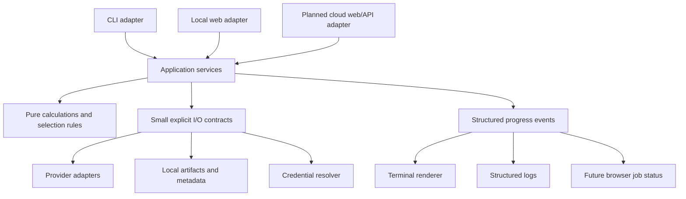

# Future enhancements and architecture plan

Updated: 2026-09-21. Status: planning baseline; proposed phases below are not
implemented merely because they appear here. Owner: project user. Implementation
priority changes with the user's requests; this document is not permission to
perform credentialed operations, publish, enable hosted CI or deploy.

## Product direction and current boundary

The required product targets are CLI, local web and cloud deployment, using one
shared calculation and application-service implementation. CLI and local web are
implemented in stages; cloud is a required future delivery target, not a verified
capability today. Cloud deployment and multi-user sharing are separate decisions:
a personal cloud workspace still needs remote access controls and secure operation.
Implementation/deployment of hosting remains C8 and requires explicit direction.

No cloud accounts, paid services, remote telemetry, hosted CI, public server,
registration system or automatic background market-data collection in the current
phase. A local web app must start on loopback only. User actions authorize fetches;
page loads and merely finding a stored credential do not. Agents continue to use
synthetic/offline verification, never credentialed provider requests.

## Three-target contract and release gates (2026-09-21)

- CLI, local web and planned cloud web/API adapters call shared use-case services.
  Calculations, validation, report selection, history and provider rules must not
  be reimplemented per interface. Track deliberate interface gaps explicitly.
- Pass workspace context, storage, credential resolution, progress and cancellation
  explicitly. Domain/services must not assume a terminal, interactive prompt,
  developer path, local OS keychain or one global user's environment.
- Local composition can use files/SQLite and OS credential stores. Cloud composition
  must supply deployment-appropriate persistent storage and server-side secret
  access. Those implementations, migrations and worker coordination remain planned;
  using SQLite locally is not evidence that cloud operation already works.
- Remote access requires authentication, authorization, TLS, workspace isolation,
  safe secret handling, recovery and operational validation before deployment.
  Do not expose the current loopback app as a cloud-ready server. Multi-user
  isolation and provider data rights add separate requirements if sharing is chosen.
- Secure token onboarding is C6a, after C5 recovery and before saved screeners/fetch
  controls. Reuse C1 and prepared C2 guidance for add/replace/remove, hidden input,
  format checks, user-run authentication checks and expiry handling. CLI/local-web
  control scope is still to be selected; backend validation must be shared.
  Cloud callers must use noninteractive scoped secret resolution; never a global
  per-user environment mutation or browser-returned stored token. OTA renewal is
  user-run and cannot be solved by storage alone.
- Major releases require recorded checks on native Windows PowerShell, Ubuntu/WSL,
  and macOS: offline suites, startup/shutdown, report/filter/export workflows,
  history migration/replay/recovery, and credential lifecycle where supported.
  Native Windows verification stays at major releases, including platform-sensitive
  changes; it is not an intermediate development gate. Continue guarded local
  offline checks each increment. Record OS/Python/dependencies/revision and skips.
  WSL success does not establish native Windows or macOS compatibility. If a
  platform is unavailable, mark its acceptance pending rather than claim support.
- When cloud implementation arrives, add deployment-specific parity, persistence,
  authentication/isolation and restart/job-recovery checks. Local OS checks do not
  establish cloud readiness. Hosted CI remains disabled pending explicit approval.

Keep README, STATUS, RESUME_PLAN, this planner, relevant setup/feature docs and
consequential decision notes synchronized in each increment. Separate implemented,
offline-tested, user-verified and planned behavior; record platform evidence and
remaining interface gaps as work progresses.

## Architectural decisions

Use a **modular monolith**: one Python application/repository with clear internal
boundaries, not independently deployed microservices. This is a project choice
for readability and low operating cost, not a claim of a universally best design.
Separate presentation, orchestration, calculations and external I/O so a second
interface does not require a second scanner implementation.

Dependency rules:

- Domain code uses ordinary typed values and performs no network, credential,
  database, terminal or web-framework operations.
- Application services implement use cases. They accept explicit inputs,
  dependencies, progress and cancellation; return typed results with safe errors.
  They never invoke CLI commands or web handlers as an internal API.
- CLI/web adapters validate interface inputs and translate results. They do not
  duplicate ranking, monthly-expiry selection, provider parsing or join rules.
- Infrastructure implements narrow provider/storage/credential interfaces. Its
  imports must not load credentials, start workers or perform network operations.
- A composition module creates concrete dependencies. Avoid global mutable
  workspace state, import-time setup and hidden service lookups.
- Introduce interfaces at demonstrated boundaries, not a class for every function.
  Prefer plain functions, small dataclasses and explicit method names over generic
  repositories, plugin frameworks, deep inheritance or dependency-injection tools.

Keep the base offline core lightweight. Select a web framework and any optional
packages when the first web increment is ready, using a small architecture decision
record (ADR). Prefer a small same-origin, server-rendered UI initially; a separate
JavaScript SPA/toolchain must solve a demonstrated need before adoption.

## Current code and migration seams

This mapping describes current files and proposed extractions, not a mass rename.
Move behavior only when the corresponding increment includes parity tests.

| Current module | Retain/reuse | Proposed separation |
| --- | --- | --- |
| `core.py`, `chain_spreads.py` | CRS and deterministic contract selection | Domain layer; keep provider/web/storage dependencies out |
| `cli.py`, `workflow.py` | Existing commands and orchestration behavior | Thin CLI plus explicit application services; remove internal CLI dispatch from orchestration |
| `ota_fetch.py`, `tradier.py`, `tradier_batch.py`, `public_data.py` | Provider request/parse/capture behavior | Provider adapters separate from prompting, run lifecycle and report output |
| `ota_pipeline.py`, `dashboard.py` | Raw profiling, normalization, canonical joins | Pure transformations separate from file loading and rendering |
| `progress.py` | Safe event fields, timings, errors and progress semantics | Event creation/sink interface separate from terminal rendering and file logging |
| `report.py`, dashboard HTML renderer | Exports and existing local reports | Presentation adapters consuming shared report models |
| `token_store.py` | Explicit profile-specific OS credential access | Credential reference/resolver separate from terminal prompts |

Possible eventual package layout: `domain/`, `application/`, `adapters/providers/`,
`adapters/storage/`, `interfaces/cli/`, `interfaces/web/`, and `bootstrap.py`.
Do not create empty scaffolding or move all modules merely to match this sketch.
Keep `run.py` and existing CLI flags compatible during incremental extraction.

## Data and workspace contracts

- The versioned master universe drives acquisition and left joins. Retain members
  that lack rankings/provider results; provider coverage must not redefine it.
- Canonical symbols and provider-specific mappings stay at explicit boundaries.
  Current symbol mapping is not historical security identity. Stable security IDs,
  symbol changes and corporate-action lineage require their own future design.
- Preserve capture → field profiling → versioned normalization → business rules.
  Raw data is immutable evidence, not a validated calculation input. Retain unknown
  fields and per-field interpretation status; never manufacture missing metrics.
- Pin master ID, selected input run IDs, configuration version/hash and calculation
  version in a report/job. Resolve a requested "latest" once at job creation,
  not separately during execution. Display partial coverage and mismatched ages.
- Preserve source/profile, retrieval time, observation time when supplied, and units.
  Sequential fetches are not a simultaneous market snapshot. Staleness policy must
  remain distinct from mere recent retrieval.
- Introduce an explicit `WorkspaceContext`: local workspace ID, data directory,
  selected profile and timezone preference. Initially it describes one owner; it
  does not pretend to supply authentication or tenant isolation.
- Keep settings, credential references, raw artifacts, derived artifacts and logs
  distinct. Never serialize credentials into a job, URL, browser storage or result.
- Use opaque artifact IDs at the web boundary, resolved within the workspace.
  Do not expose arbitrary filesystem paths through HTTP routes or serve the entire
  artifacts directory. Raw captures and credential stores are not static assets.

Suggested service contracts (names are illustrative): `fetch_provider(request,
context, event_sink, cancellation) -> FetchResult`, `build_report(request,
context) -> ReportResult`, and `get_job(job_id, context) -> JobStatus`.
Result models carry IDs/status/coverage/safe errors; file-path printing is a CLI
concern. Explicit `partial` results remain distinguishable from success.

## Ordered delivery plan and acceptance gates

### P0 — Preserve current correctness and establish boundaries

Priority: first; incremental local maintenance, no web dependencies.

- Add focused characterization fixtures for CLI outputs, master membership,
  source joins, malformed/mixed data, partial fetches and error contracts.
- Extract one service at a time, starting with cached report composition, followed
  by Tradier batch and OTA orchestration. Keep compatibility wrappers temporarily.
- Separate serializable progress events from terminal/file sinks. CLI and future
  web observers consume the same events; observer code must not contain strategy.
- Centralize runtime paths and explicit configuration without reading credentials
  on import. Preserve current commands and saved-artifact readers.

Acceptance: equivalent calculations and provider selection on identical fixtures;
unchanged user commands; no network/secret access during default tests; no output
loss; one implementation of each use case. No unrelated large-scale reformatting.

### P1 — Durable local jobs and searchable metadata

Dependency: service boundaries from P0. No hosted queue or external database.

- Add SQLite for run/job/artifact metadata when job management needs transactional
  updates. Keep large raw responses and exports as local files, referenced by ID.
  The database is a metadata index, not a second copy of every raw response.
- Version the database schema and artifact manifests separately; include migration,
  backup/restore and old-artifact import tests. Do not silently rewrite originals.
- Use one local worker and a durable local job table initially. Define transactional
  claims and recovery before adding concurrency. CLI and web share submission and
  status services; synchronous CLI commands may wait on the same service result.
- Job states: queued, running, cancel_requested, succeeded, partial, failed,
  cancelled, interrupted. Specify legal transitions; restart must not report an
  abandoned running job as completed. Do not automatically resume credentialed work
  after restart without an explicit user action.
- Cancellation checks occur between requests/stages, with bounded network timeouts.
  Cancelling a UI request does not prove the worker stopped. A worker owns terminal
  state transitions and preserves completed captures/checkpoints.
- Prevent duplicate submission/double-click work with an idempotency key tied to
  the user's action. Do not claim exactly-once provider execution after a crash.
- Coordinate provider pacing across CLI/web jobs sharing a credential reference.
  Do not persist the secret or derive a public identifier from its value. Start
  with one active provider job; use explicit busy/queued behavior.
- Add elapsed time, safe error-category counts, coverage and request statistics to
  review summaries. Design resume/retry of failed members separately, pinned to
  master/profile/date, without silently mixing old and newly fetched quotes.

Acceptance: deterministic job lifecycle tests, duplicate submission tests,
interruption/recovery and cancellation tests, no duplicate job claims, unchanged
partial-data semantics, safe progress replay and successful metadata restore.
Actual process/OS behavior requires separately recorded local smoke validation.

SQLite is the planned local default because it is designed for embedded/local
storage; it is not a promise of unlimited write concurrency. Reassess database
choice when deployment topology and concurrent writes require it. See
[SQLite's guidance](https://www.sqlite.org/whentouse.html).

### P2 — Local web app, one personal workspace

Dependency: P0; P1 is required before enabling long-running fetch controls.
A read-only saved-results UI may precede job execution.

- Launch explicitly on `127.0.0.1`; no LAN/public binding, tunnel, container platform
  or cloud resources by default. Preserve CLI and CSV/HTML exports.
- First screens: master list/provider coverage, saved reports, run history,
  configuration preview and job details with progress/errors/output links.
- Add explicit fetch/cancel controls after durable jobs are available. Page loads,
  refreshes and filter changes do not trigger provider calls. Initial progress can
  use bounded polling; add server-sent events only when they improve the experience.
- Use one same-origin application. Escape provider text, validate Host/Origin,
  protect state-changing requests against CSRF and restrict artifact resolution.
  Loopback binding is not sufficient protection from other browser pages.
- Keep credential retrieval on the backend. Initially configure keys locally using
  existing CLI/OS-store support; avoid inventing a browser credential-management UI.
- Store a user's display timezone preference separately from source UTC timestamps;
  default to the local runtime zone. A future remote server's zone is not the user's.
- Pagination/filtering must operate on the complete selected master dataset. Show
  absent, stale, failed and unranked states clearly without conflating them.

Acceptance: CLI/service/web parity on synthetic fixtures; local-only startup;
responsive UI while a fake slow job runs; cancel/refresh/reconnect behavior;
blocked cross-origin mutations and path traversal; no credentials in responses or
logs; reproducible startup/stop instructions. Default tests remain network-denying
and use in-process web test clients where possible. Actual browser/OS checks are
separate, explicit local checks, not a weakening of default test isolation.

### P3 — Harden the personal application before considering hosting

Dependency: usable P2. Remains personal and local.

- User-run multi-screener/provider validation, snapshot retention controls,
  disk-capacity handling, recovery, database migration and backup/restore drills.
- Cross-run schema/type drift summaries, field interpretation inspection, request
  telemetry and explicit batch resume controls. Shared bounded request backoff is
  implemented; validate it live without retrying authentication blindly.
- Assess master refresh policy, alias changes, quote freshness and time-aligned
  comparisons. Add filter rejection counts before tuning candidate thresholds.
- Review optional web dependencies and portable setup. Validate native Windows,
  Ubuntu/WSL and macOS separately; report actual evidence rather than assumptions.

Acceptance: documented recovery exercises, verified user workflows and no known
silent loss, duplicate work or cross-profile data mixing in tested scenarios.

### P4 — Sharing and hosting decision gate, deferred

No implementation/deployment authorization is implied by this plan.
Before offering access to another person, decide whether data is private per user,
shared under appropriate rights, or limited to explicitly published reports.

Required work before multi-user exposure:

- Authentication and server-enforced workspace ownership on every job, report,
  artifact, settings and credential operation; explicit sharing permissions.
- Per-user credentials and provider entitlements. Review data display, retention
  and redistribution rights for the actual deployment; personal access does not
  authorize redistribution. OTA session expiry/acquisition remains an unresolved
  constraint for unattended or shared use; do not build browser-login automation.
- Tenant-isolated storage, logs, caches, worker claims and quota accounting;
  cross-user access tests include guessed IDs and background worker execution.
- Durable worker lifecycle, shared rate limiting, secrets management, TLS, resource
  limits, backup/recovery, retention/deletion and operational observability.
- Select hosting, database and object storage only after expected users, concurrency,
  data rights and an owner-approved cost budget are known. Add hosted CI separately
  only on explicit request. Repository creation, publishing and deployment remain
  subject to existing authorization boundaries.

Acceptance: reviewed architecture/security/cost decisions, passing isolation and
recovery checks, provider-use review, and explicit owner approval to deploy/share.
Cloud readiness is not achieved merely by adding a user_id column or a container.

## Change review required for every request

Before implementation, assess the request proportionally against this planner:

1. What current user outcome and smallest reviewable increment does it deliver?
2. Which boundaries change: domain, provider, service, storage, jobs, UI, credentials?
3. Does it preserve master-list ownership, raw lineage, explicit profiles and
   personal-local execution? What would CLI/web reuse require?
4. Does it introduce global state, arbitrary paths, UI-specific logic in services,
   duplicate calculations, implicit fetching or incompatible artifact changes?
5. What regression/parity tests and migration/rollback evidence are needed?
6. Is it implementing today's need, preserving a useful seam, or prematurely
   building a future phase? Defer speculative machinery and record why.

For routine compatible fixes, a brief internal check is enough; do not make every
request a long architecture essay. Explain material tradeoffs to the user. When a
change alters architecture, sequence or scope, update this plan and status notes
in the same increment. Current explicit user instructions take precedence over
this plan; do not treat the plan as grounds for unnecessary approval requests.

## Onboarding and continued progress

Current onboarding uses [an interactive assistant role](SETUP_AGENT.md) and
[a manual guide](SETUP.md). Both begin with OS/shell, comfort level and existing
setup, then a credential-free local demo. These documents exist; an executable
setup wizard and an in-app onboarding screen do not yet exist.

At task completion or natural milestones, agents recommend one useful next step
and invite user suggestions. This feedback should inform priorities without
repeating questions, blocking authorized work or automatically implementing future
phases. Preserve current user intent and adjust the plan when priorities change.

For P2, reuse these onboarding checkpoints in a local web first-run experience:
workspace selection, synthetic demo, optional provider configuration and diagnostic
handoff. Keep installation logic separate from application services. Acceptance
must include novice walkthroughs on each supported OS, adaptive detail, resuming
completed steps and no secret exposure. Do not install an agent service or introduce
a hosted dependency just to provide setup guidance.

## Decision and backlog maintenance

Current decisions: personal local workspace; modular monolith; one domain/service
implementation; master-driven joins; raw-first ingestion; local files plus SQLite
metadata when needed; one local worker initially; hosted infrastructure deferred.
These are design choices, not claims that proposed components already exist.

Selected for C3a: Flask/Jinja and Waitress (see decision 0002).
Unselected: worker process mechanism, ORM (if any), cloud vendor,
cloud database, identity provider and multi-user data-sharing model. Record each
consequential choice in `docs/decisions/NNNN-short-title.md` when it is actually
made: context, alternatives, decision, tradeoffs, acceptance and migration impact.
Do not create speculative ADRs merely to fill a directory.

Track each implementation increment in [STATUS.md](STATUS.md) with planned,
implemented, offline-verified and user-verified distinctions. Link tests/evidence
and note deferred work. Keep this plan and the [README](../README.md) consistent.

## Architectural references

These sources inform bounded design decisions; their products are not required:

- [Web/queue/worker separation](https://learn.microsoft.com/en-us/azure/architecture/guide/architecture-styles/web-queue-worker):
  supports moving long-running work outside request handling. Our initial queue
  would be local and durable, not an Azure dependency.
- [SQLite deployment guidance](https://www.sqlite.org/whentouse.html): local storage
  suitability and the point at which client/server storage may be preferable.
- [OWASP CSRF prevention](https://cheatsheetseries.owasp.org/cheatsheets/Cross-Site_Request_Forgery_Prevention_Cheat_Sheet.html):
  informs browser mutation controls; this plan is not evidence those controls exist.

## Adopted increment: provider governor

The shared `throttling.py` service now owns conservative provider pacing, local
feedback, retry/cooldown decisions and workload estimates. HTTP adapters feed it
status/quota observations; CLI progress renders its estimates. See
[the operational policy](THROTTLING.md). A workspace lease serializes each provider
profile locally. Future web jobs should reuse this boundary and add account-aware
coordination across workers/machines, explicit cancellation and checkpoint resume.
Those distributed/job features remain pending; local feedback is not shared cloud
state. Live provider validation of this increment remains user-run.

## Adopted increment: personal schedule preferences (2026-09-20)

`scheduling.py` now supplies a versioned personal schedule and SQLite daily claims,
next-occurrence/status/history APIs and explicit interrupted-job acknowledgement.
`schedule_cli.py` is the thin CLI/worker adapter; `scheduled_workflows.py` dispatches
allowlisted services. `scan_service.py` extracts scan execution from the CLI so the
daily workflow no longer recursively parses command-line arguments. Existing CLI
commands and artifact formats remain compatible.

All new user-facing controls, not only schedules, must be modeled as reusable
settings/services with explicit workspace ownership and a documented future web
control. Keep personal preferences outside Git and secrets in separate storage.
The P2 settings/setup wizard must expose schedule time, IANA timezone, selected task,
enabled state, grace window, next due time and job history/recovery using this API.
The setup-agent flow now covers personalization after a first provider run.

This is a bounded P1 slice, not the complete job architecture. One personal daily
schedule is supported; multiple schedules, Tradier task registration, web endpoints,
remote cancellation, distributed coordination and OS service installation remain
pending. Per-day claims prevent automatic duplicate attempts but cannot guarantee
exactly-once provider effects. Provider-session expiry remains a live limitation.
See [Scheduling](SCHEDULING.md) for semantics and user-run activation.

## Adopted increment: OTA report model and export service (2026-09-20)

`ota_reporting.py` provides a pure inventory model, option validation and renderers;
`ota_report_service.py` loads a saved snapshot and publishes an immutable report
bundle. New CLI commands use that service. Comprehensive OTA rows remain an
inventory; existing master-driven CRS/Tradier joins keep their original boundary.
No scoring or filtering rule was imported from the INBOX presentation reference.

The future report page should expose saved-source selection, console/table preview
limits, page size, search/sector/sort controls, profile inspection and downloads.
Resolve browser artifact IDs inside the workspace, submit generation as a local
job, and reuse this model rather than rebuilding financial interpretation in the
web layer. Report preferences may later be persisted through the personal settings
service; this increment uses explicit per-run options. Browser controls for saved
files exist; web-server endpoints remain pending. See [OTA reports](OTA_REPORTS.md).

The combined report also retains all OTA fields under `ota_raw.*`, separate from
interpreted filter metrics and master-owned columns. Reuse `combine()` and
`write_dashboard()` through the existing workflow service for future web jobs;
keep source selection and export controls in the UI, with join and CRS rules in
the shared model. Raw-field presentation and Excel CSV output now have isolated
regression coverage. Web endpoints and persistent column preferences remain future work.

HTML percentile-tail controls are presentation-only over saved CRS percentiles.
Future web controls should use these same peer-group percentiles and keep display
selection distinct from persisted candidate rules and source-fetch settings.

Shared `run_ids.py` supplies timestamp-prefixed unique operation IDs for current
CLI workflows and future web jobs. Keep legacy artifact identifiers readable and
use explicit timestamps/timezones for chronology rather than parsing IDs.

## Next delivery sequence: secrets and versioned history

[RESUME_PLAN.md](RESUME_PLAN.md) specifies C1-C8 (including C3a) and the next-thread handoff.
It refines P0/P1: first a provider-independent credential loader and Infisical
onboarding; then SQLite catalog, append-only CRS history/canonical session views,
backup/restore and local-web reuse. Git owns code/migrations/reviewed defaults;
private database and artifact files own runtime history. Large raw responses stay
in immutable files. Existing schedule storage and legacy history need explicit
compatibility/migration, not replacement by a parallel implementation.

Delivery priority: C3a provides the first runnable localhost saved-results preview
after the artifact catalog, ahead of advanced history work. Complete C6 local web
acceptance before C7 Finviz/Interactive Brokers feasibility and adapters. Hosting
is C8, separate from testing the personal local web application.

## Adopted increment: explicit credential resolver (C1)

`credentials.resolve` is now the shared runtime env/store/prompt boundary. CLI
commands retain prior defaults; explicit env injection is opt-in. Future web and
worker callers must leave prompting disabled and pass resolved credentials to
services. `credential-check` provides an allowlisted user-run format check, not
authentication evidence. No secret-manager SDK or scheduler activation was added.

## Adopted increment: local artifact catalog (C3)

`Catalog` and `catalog_service` now supply explicit saved-source indexing,
immutable copies, metadata migrations and reconciliation counts. This is a
report/source catalog, not P1 durable fetch jobs. Existing scheduling storage is
unchanged. See [catalog contracts](CATALOG.md) and [decision 0001](decisions/0001-local-catalog.md).
C3a can use opaque IDs without scanning raw provider directories on startup.

## Adopted increment: localhost saved-results preview (C3a)

Flask/Jinja plus Waitress now serve explicit saved-source selection, reports,
run history, coverage/diagnostics and full/filtered CSV through shared Python
composition and selection services. See [startup/acceptance](LOCAL_WEB.md).
No provider execution or scheduling controls are exposed. This precedes C4
history and C5 backup work; P1 durable fetch jobs still gate C6 fetch controls.
Actual browser/Excel acceptance remains open despite isolated route and synthetic
HTTP checks. Do not treat C3a as C6 acceptance or begin Finviz/IBKR prematurely.

## Shared-machine resource constraint (2026-09-20)

The user confirmed basic synthetic report visibility in Windows Chrome and asks
that CPU/memory overhead stay low alongside TradingView, TOS and other demanding
apps. Target shared 8–16 GB RAM machines; the owner's 32 GB machine provides
development headroom. This target has not yet been validated on 8–16 GB hardware. Keep
server-rendered, demand-driven pages and disabled scheduling. Before C4–C6 adds
history or workers, assess peak memory, concurrent requests and background work.
Budget selection depends on remaining available RAM/CPU and realistic saved data;
no hard quota or global WSL limit is implemented. Measure first rather than adding
unbounded caches or changing frameworks. C3a currently decodes full reports for
views and builds CSV in memory; future optimization should retain shared selection
and full/filtered-export parity. See [measured scope](LOCAL_WEB.md#resource-use-and-shared-machine-constraint).

## Column filtering, expressions and watchlist progression (2026-09-20)

C3a now has shared all-column selection, numeric/text/presence rules combined
with AND, stable mixed-type sorting, visible-column controls and filtered
TradingView text export grouped by existing IV gauge. The local web adapter uses
these services for table/CSV/watchlist membership before pagination. Original
source values and CRS/candidate rules remain unchanged. Legacy standalone HTML
is unchanged; this increment targets the active localhost dashboard.

C3b is now implemented after user feedback on C3a. Next is **C3b builder feedback
→ C4 history → C5 recovery → C6
saved screeners/settings and durable jobs → C7 providers**. C3b supplies a bounded,
versioned typed rule tree for cross-column comparisons (`A > 1.5 * B`) and nested
AND/OR, before C4 needs reproducible rule provenance. C6 provides personal preset
persistence through shared validation. See [C3b acceptance](FILTER_EXPRESSIONS.md).
The version-1 expression contract, unit registry and typed evaluator are shared
with table/CSV/watchlist selection. The editor keeps drafts separate from applied
filters and reports validation failures without changing the applied selection.
Legacy AND rules migrate without changing membership. Limits are 32 rules/four
group levels; text is never executed. See [the decision](decisions/0003-report-expressions.md).
No new dependency, automatic fetch, worker or scheduling activation is introduced.
Actual browser/import/resource acceptance remains separate from offline verification.

## Adopted increment: catalog CRS revisions (C4a)

Following native Windows tests/startup and positive dashboard feedback, C4a now
records CRS projections atomically with new catalog reports. Canonical session
pointers are separate from immutable revisions; pinned prior artifacts and exact
code/evaluation clocks support replay. Shared CLI inspection/comparison/build/replay
services preserve web parity. See [CRS history](CRS_HISTORY.md) and
[decision 0004](decisions/0004-crs-history.md).

C4b now implements explicit legacy preview/import/rollback and standalone daily-workflow
integration through shared services. Import controls are CLI-only; web reports
consume the same prior-selection service and label limited legacy provenance.
Schema 3 retains import evidence and report pins after batch deactivation.
No automatic backfill, real database migration, scheduler or new
provider is authorized by this implementation. C5 recovery follows completed C4;
C6 saved selection revisions/settings/jobs and C7 providers remain later phases.
