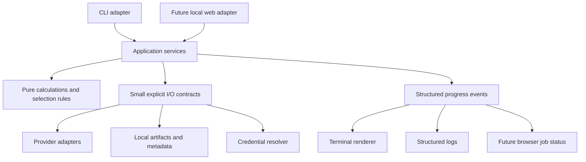

# Future enhancements and architecture plan

Updated: 2026-09-19. Status: planning baseline; proposed phases below are not
implemented merely because they appear here. Owner: project user. Implementation
priority changes with the user's requests; this document is not permission to
perform credentialed operations, publish, enable hosted CI or deploy.

## Product direction and current boundary

1. Now: strictly one user's personal local workspace, operated through the CLI
   and saved HTML/CSV reports. Preserve the working scanner while improving it.
2. Next: a local browser interface using the same application services and data.
3. Later, only after an explicit request: hosting and controlled sharing with
   other people. Multi-user access is a separate product and security milestone.

No cloud accounts, paid services, remote telemetry, hosted CI, public server,
registration system or automatic background market-data collection in the current
phase. A local web app must start on loopback only. User actions authorize fetches;
page loads and merely finding a stored credential do not. Agents continue to use
synthetic/offline verification, never credentialed provider requests.

## Architectural decisions

Use a **modular monolith**: one Python application/repository with clear internal
boundaries, not independently deployed microservices. This is a project choice
for readability and low operating cost, not a claim of a universally best design.
Separate presentation, orchestration, calculations and external I/O so a second
interface does not require a second scanner implementation.

Dependency rules:

- Domain code uses ordinary typed values and performs no network, credential,
  database, terminal or web-framework operations.
- Application services implement use cases. They accept explicit inputs,
  dependencies, progress and cancellation; return typed results with safe errors.
  They never invoke CLI commands or web handlers as an internal API.
- CLI/web adapters validate interface inputs and translate results. They do not
  duplicate ranking, monthly-expiry selection, provider parsing or join rules.
- Infrastructure implements narrow provider/storage/credential interfaces. Its
  imports must not load credentials, start workers or perform network operations.
- A composition module creates concrete dependencies. Avoid global mutable
  workspace state, import-time setup and hidden service lookups.
- Introduce interfaces at demonstrated boundaries, not a class for every function.
  Prefer plain functions, small dataclasses and explicit method names over generic
  repositories, plugin frameworks, deep inheritance or dependency-injection tools.

Keep the base offline core lightweight. Select a web framework and any optional
packages when the first web increment is ready, using a small architecture decision
record (ADR). Prefer a small same-origin, server-rendered UI initially; a separate
JavaScript SPA/toolchain must solve a demonstrated need before adoption.

## Current code and migration seams

This mapping describes current files and proposed extractions, not a mass rename.
Move behavior only when the corresponding increment includes parity tests.

| Current module | Retain/reuse | Proposed separation |
| --- | --- | --- |
| `core.py`, `chain_spreads.py` | CRS and deterministic contract selection | Domain layer; keep provider/web/storage dependencies out |
| `cli.py`, `workflow.py` | Existing commands and orchestration behavior | Thin CLI plus explicit application services; remove internal CLI dispatch from orchestration |
| `ota_fetch.py`, `tradier.py`, `tradier_batch.py`, `public_data.py` | Provider request/parse/capture behavior | Provider adapters separate from prompting, run lifecycle and report output |
| `ota_pipeline.py`, `dashboard.py` | Raw profiling, normalization, canonical joins | Pure transformations separate from file loading and rendering |
| `progress.py` | Safe event fields, timings, errors and progress semantics | Event creation/sink interface separate from terminal rendering and file logging |
| `report.py`, dashboard HTML renderer | Exports and existing local reports | Presentation adapters consuming shared report models |
| `token_store.py` | Explicit profile-specific OS credential access | Credential reference/resolver separate from terminal prompts |

Possible eventual package layout: `domain/`, `application/`, `adapters/providers/`,
`adapters/storage/`, `interfaces/cli/`, `interfaces/web/`, and `bootstrap.py`.
Do not create empty scaffolding or move all modules merely to match this sketch.
Keep `run.py` and existing CLI flags compatible during incremental extraction.

## Data and workspace contracts

- The versioned master universe drives acquisition and left joins. Retain members
  that lack rankings/provider results; provider coverage must not redefine it.
- Canonical symbols and provider-specific mappings stay at explicit boundaries.
  Current symbol mapping is not historical security identity. Stable security IDs,
  symbol changes and corporate-action lineage require their own future design.
- Preserve capture → field profiling → versioned normalization → business rules.
  Raw data is immutable evidence, not a validated calculation input. Retain unknown
  fields and per-field interpretation status; never manufacture missing metrics.
- Pin master ID, selected input run IDs, configuration version/hash and calculation
  version in a report/job. Resolve a requested "latest" once at job creation,
  not separately during execution. Display partial coverage and mismatched ages.
- Preserve source/profile, retrieval time, observation time when supplied, and units.
  Sequential fetches are not a simultaneous market snapshot. Staleness policy must
  remain distinct from mere recent retrieval.
- Introduce an explicit `WorkspaceContext`: local workspace ID, data directory,
  selected profile and timezone preference. Initially it describes one owner; it
  does not pretend to supply authentication or tenant isolation.
- Keep settings, credential references, raw artifacts, derived artifacts and logs
  distinct. Never serialize credentials into a job, URL, browser storage or result.
- Use opaque artifact IDs at the web boundary, resolved within the workspace.
  Do not expose arbitrary filesystem paths through HTTP routes or serve the entire
  artifacts directory. Raw captures and credential stores are not static assets.

Suggested service contracts (names are illustrative): `fetch_provider(request,
context, event_sink, cancellation) -> FetchResult`, `build_report(request,
context) -> ReportResult`, and `get_job(job_id, context) -> JobStatus`.
Result models carry IDs/status/coverage/safe errors; file-path printing is a CLI
concern. Explicit `partial` results remain distinguishable from success.

## Ordered delivery plan and acceptance gates

### P0 — Preserve current correctness and establish boundaries

Priority: first; incremental local maintenance, no web dependencies.

- Add focused characterization fixtures for CLI outputs, master membership,
  source joins, malformed/mixed data, partial fetches and error contracts.
- Extract one service at a time, starting with cached report composition, followed
  by Tradier batch and OTA orchestration. Keep compatibility wrappers temporarily.
- Separate serializable progress events from terminal/file sinks. CLI and future
  web observers consume the same events; observer code must not contain strategy.
- Centralize runtime paths and explicit configuration without reading credentials
  on import. Preserve current commands and saved-artifact readers.

Acceptance: equivalent calculations and provider selection on identical fixtures;
unchanged user commands; no network/secret access during default tests; no output
loss; one implementation of each use case. No unrelated large-scale reformatting.

### P1 — Durable local jobs and searchable metadata

Dependency: service boundaries from P0. No hosted queue or external database.

- Add SQLite for run/job/artifact metadata when job management needs transactional
  updates. Keep large raw responses and exports as local files, referenced by ID.
  The database is a metadata index, not a second copy of every raw response.
- Version the database schema and artifact manifests separately; include migration,
  backup/restore and old-artifact import tests. Do not silently rewrite originals.
- Use one local worker and a durable local job table initially. Define transactional
  claims and recovery before adding concurrency. CLI and web share submission and
  status services; synchronous CLI commands may wait on the same service result.
- Job states: queued, running, cancel_requested, succeeded, partial, failed,
  cancelled, interrupted. Specify legal transitions; restart must not report an
  abandoned running job as completed. Do not automatically resume credentialed work
  after restart without an explicit user action.
- Cancellation checks occur between requests/stages, with bounded network timeouts.
  Cancelling a UI request does not prove the worker stopped. A worker owns terminal
  state transitions and preserves completed captures/checkpoints.
- Prevent duplicate submission/double-click work with an idempotency key tied to
  the user's action. Do not claim exactly-once provider execution after a crash.
- Coordinate provider pacing across CLI/web jobs sharing a credential reference.
  Do not persist the secret or derive a public identifier from its value. Start
  with one active provider job; use explicit busy/queued behavior.
- Add elapsed time, safe error-category counts, coverage and request statistics to
  review summaries. Design resume/retry of failed members separately, pinned to
  master/profile/date, without silently mixing old and newly fetched quotes.

Acceptance: deterministic job lifecycle tests, duplicate submission tests,
interruption/recovery and cancellation tests, no duplicate job claims, unchanged
partial-data semantics, safe progress replay and successful metadata restore.
Actual process/OS behavior requires separately recorded local smoke validation.

SQLite is the planned local default because it is designed for embedded/local
storage; it is not a promise of unlimited write concurrency. Reassess database
choice when deployment topology and concurrent writes require it. See
[SQLite's guidance](https://www.sqlite.org/whentouse.html).

### P2 — Local web app, one personal workspace

Dependency: P0; P1 is required before enabling long-running fetch controls.
A read-only saved-results UI may precede job execution.

- Launch explicitly on `127.0.0.1`; no LAN/public binding, tunnel, container platform
  or cloud resources by default. Preserve CLI and CSV/HTML exports.
- First screens: master list/provider coverage, saved reports, run history,
  configuration preview and job details with progress/errors/output links.
- Add explicit fetch/cancel controls after durable jobs are available. Page loads,
  refreshes and filter changes do not trigger provider calls. Initial progress can
  use bounded polling; add server-sent events only when they improve the experience.
- Use one same-origin application. Escape provider text, validate Host/Origin,
  protect state-changing requests against CSRF and restrict artifact resolution.
  Loopback binding is not sufficient protection from other browser pages.
- Keep credential retrieval on the backend. Initially configure keys locally using
  existing CLI/OS-store support; avoid inventing a browser credential-management UI.
- Store a user's display timezone preference separately from source UTC timestamps;
  default to the local runtime zone. A future remote server's zone is not the user's.
- Pagination/filtering must operate on the complete selected master dataset. Show
  absent, stale, failed and unranked states clearly without conflating them.

Acceptance: CLI/service/web parity on synthetic fixtures; local-only startup;
responsive UI while a fake slow job runs; cancel/refresh/reconnect behavior;
blocked cross-origin mutations and path traversal; no credentials in responses or
logs; reproducible startup/stop instructions. Default tests remain network-denying
and use in-process web test clients where possible. Actual browser/OS checks are
separate, explicit local checks, not a weakening of default test isolation.

### P3 — Harden the personal application before considering hosting

Dependency: usable P2. Remains personal and local.

- User-run multi-screener/provider validation, snapshot retention controls,
  disk-capacity handling, recovery, database migration and backup/restore drills.
- Cross-run schema/type drift summaries, field interpretation inspection, request
  telemetry and explicit retry/resume controls. Add bounded provider-aware backoff
  only after reviewing safe retry conditions; do not retry authentication blindly.
- Assess master refresh policy, alias changes, quote freshness and time-aligned
  comparisons. Add filter rejection counts before tuning candidate thresholds.
- Review optional web dependencies and portable setup. Validate native Windows,
  Ubuntu/WSL and macOS separately; report actual evidence rather than assumptions.

Acceptance: documented recovery exercises, verified user workflows and no known
silent loss, duplicate work or cross-profile data mixing in tested scenarios.

### P4 — Sharing and hosting decision gate, deferred

No implementation/deployment authorization is implied by this plan.
Before offering access to another person, decide whether data is private per user,
shared under appropriate rights, or limited to explicitly published reports.

Required work before multi-user exposure:

- Authentication and server-enforced workspace ownership on every job, report,
  artifact, settings and credential operation; explicit sharing permissions.
- Per-user credentials and provider entitlements. Review data display, retention
  and redistribution rights for the actual deployment; personal access does not
  authorize redistribution. OTA session expiry/acquisition remains an unresolved
  constraint for unattended or shared use; do not build browser-login automation.
- Tenant-isolated storage, logs, caches, worker claims and quota accounting;
  cross-user access tests include guessed IDs and background worker execution.
- Durable worker lifecycle, shared rate limiting, secrets management, TLS, resource
  limits, backup/recovery, retention/deletion and operational observability.
- Select hosting, database and object storage only after expected users, concurrency,
  data rights and an owner-approved cost budget are known. Add hosted CI separately
  only on explicit request. Repository creation, publishing and deployment remain
  subject to existing authorization boundaries.

Acceptance: reviewed architecture/security/cost decisions, passing isolation and
recovery checks, provider-use review, and explicit owner approval to deploy/share.
Cloud readiness is not achieved merely by adding a user_id column or a container.

## Change review required for every request

Before implementation, assess the request proportionally against this planner:

1. What current user outcome and smallest reviewable increment does it deliver?
2. Which boundaries change: domain, provider, service, storage, jobs, UI, credentials?
3. Does it preserve master-list ownership, raw lineage, explicit profiles and
   personal-local execution? What would CLI/web reuse require?
4. Does it introduce global state, arbitrary paths, UI-specific logic in services,
   duplicate calculations, implicit fetching or incompatible artifact changes?
5. What regression/parity tests and migration/rollback evidence are needed?
6. Is it implementing today's need, preserving a useful seam, or prematurely
   building a future phase? Defer speculative machinery and record why.

For routine compatible fixes, a brief internal check is enough; do not make every
request a long architecture essay. Explain material tradeoffs to the user. When a
change alters architecture, sequence or scope, update this plan and status notes
in the same increment. Current explicit user instructions take precedence over
this plan; do not treat the plan as grounds for unnecessary approval requests.

## Decision and backlog maintenance

Current decisions: personal local workspace; modular monolith; one domain/service
implementation; master-driven joins; raw-first ingestion; local files plus SQLite
metadata when needed; one local worker initially; hosted infrastructure deferred.
These are design choices, not claims that proposed components already exist.

Unselected: web framework, worker process mechanism, ORM (if any), cloud vendor,
cloud database, identity provider and multi-user data-sharing model. Record each
consequential choice in `docs/decisions/NNNN-short-title.md` when it is actually
made: context, alternatives, decision, tradeoffs, acceptance and migration impact.
Do not create speculative ADRs merely to fill a directory.

Track each implementation increment in [STATUS.md](STATUS.md) with planned,
implemented, offline-verified and user-verified distinctions. Link tests/evidence
and note deferred work. Keep this plan and the [README](../README.md) consistent.

## Architectural references

These sources inform bounded design decisions; their products are not required:

- [Web/queue/worker separation](https://learn.microsoft.com/en-us/azure/architecture/guide/architecture-styles/web-queue-worker):
  supports moving long-running work outside request handling. Our initial queue
  would be local and durable, not an Azure dependency.
- [SQLite deployment guidance](https://www.sqlite.org/whentouse.html): local storage
  suitability and the point at which client/server storage may be preferable.
- [OWASP CSRF prevention](https://cheatsheetseries.owasp.org/cheatsheets/Cross-Site_Request_Forgery_Prevention_Cheat_Sheet.html):
  informs browser mutation controls; this plan is not evidence those controls exist.
